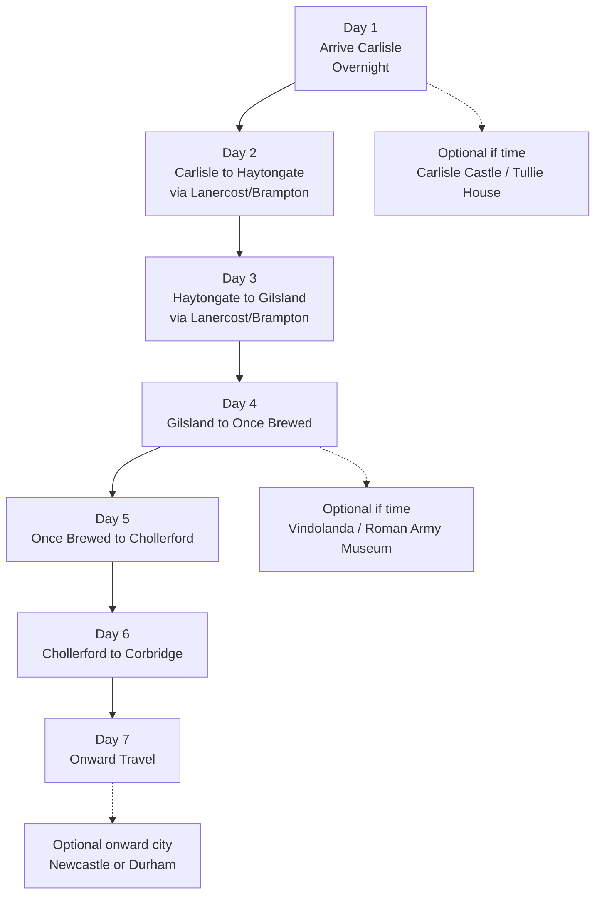

# Hadrian's Wall Itinerary Diagram

```mermaid
flowchart TD
    D1[Day 1\nArrive Carlisle\nOvernight]
    D2[Day 2\nCarlisle to Haytongate\nvia Lanercost/Brampton]
    D3[Day 3\nHaytongate to Gilsland\nvia Lanercost/Brampton]
    D4[Day 4\nGilsland to Once Brewed]
    D5[Day 5\nOnce Brewed to Chollerford]
    D6[Day 6\nChollerford to Corbridge]
    D7[Day 7\nOnward Travel]

    D1 --> D2 --> D3 --> D4 --> D5 --> D6 --> D7

    O1[Optional if time\nCarlisle Castle / Tullie House]
    O2[Optional if time\nVindolanda / Roman Army Museum]
    O3[Optional onward city\nNewcastle or Durham]

    D1 -.-> O1
    D4 -.-> O2
    D7 -.-> O3
```
