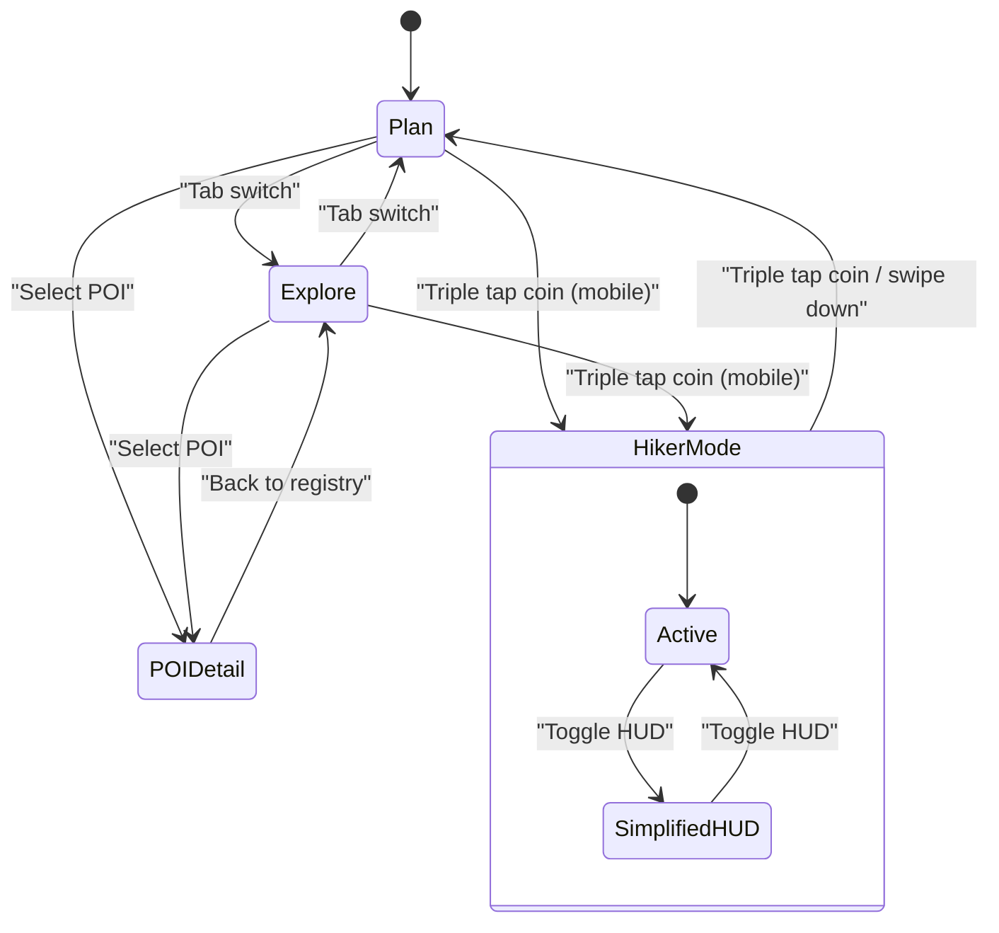
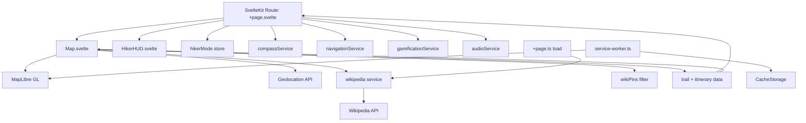
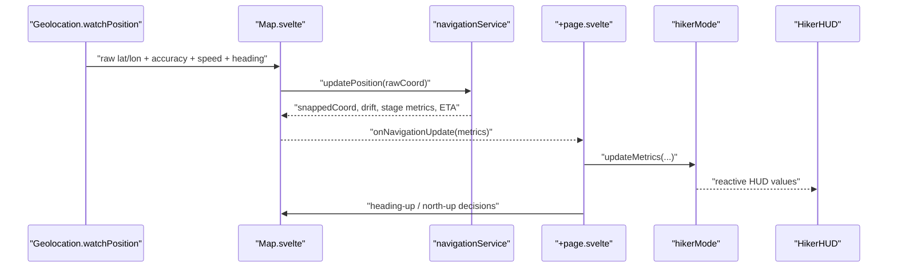
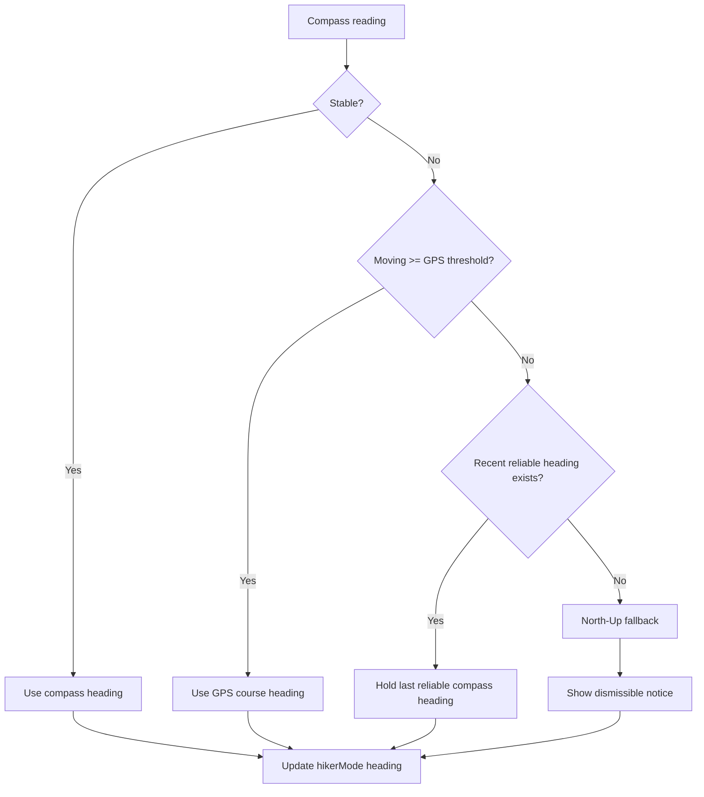
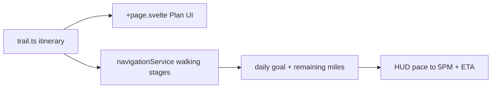
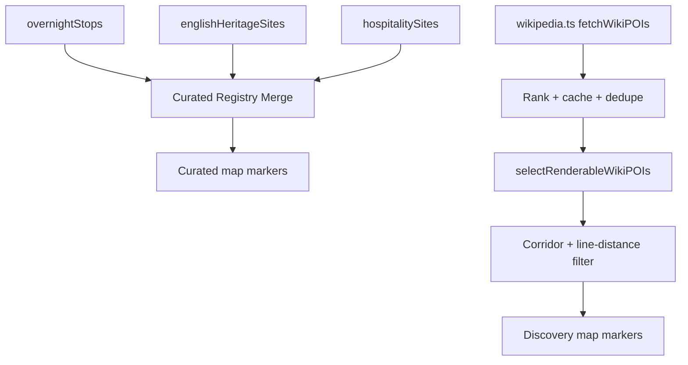
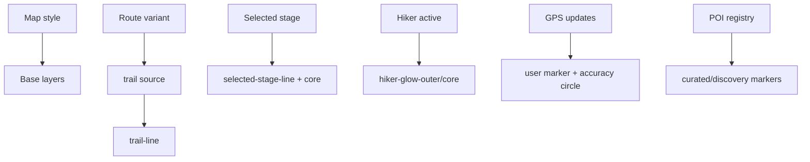
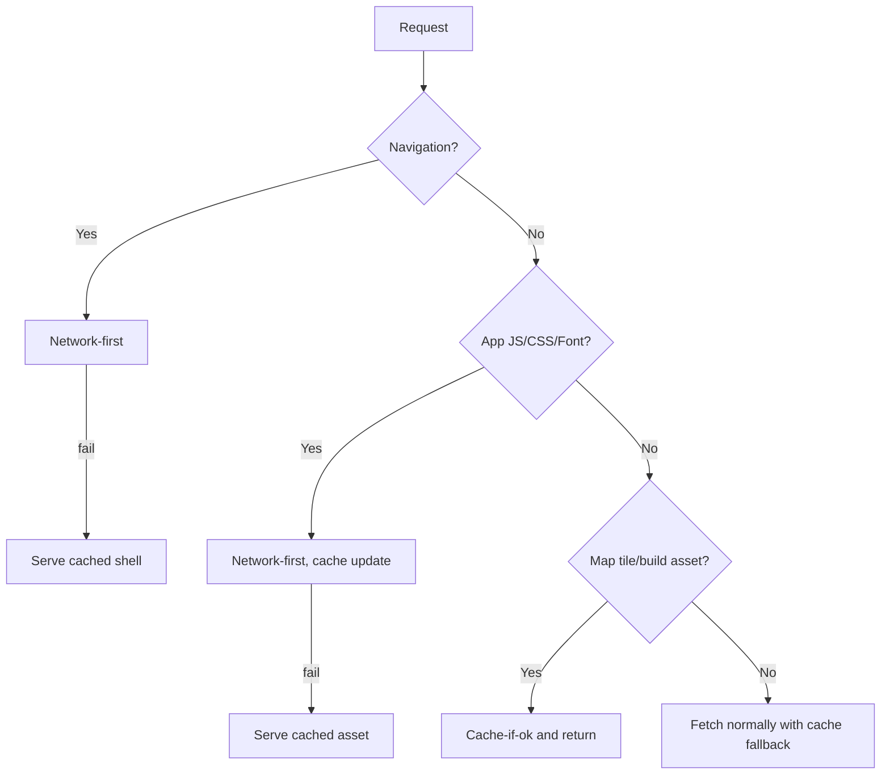

# Hadrian Atlas v4.2

Hadrian Atlas is a mobile-first tactical PWA for the Hadrian's Wall Path. It combines route navigation, stage planning, historical/cultural POI discovery, and a hiker-focused HUD with anti-fragile heading behavior.

## What It Does

- Tracks the route with map snapping and off-trail drift detection.
- Shows plan stages (Day 0 to Day 7) with daily logistics, distance, elevation, and milestones.
- Surfaces curated POIs (Heritage, Hospitality) plus Wikipedia discovery pins.
- Runs a dedicated Hiker Mode on mobile with heading-aware map orientation, pace-to-deadline guidance, and progress HUD.
- Works offline with service worker caching of app shell, static assets, and map tiles.

## Runtime Modes

- `Plan`: stage-by-stage itinerary and logistics.
- `Explore`: searchable registry + category filters.
- `Map`: full MapLibre view with style/route toggles and live location.
- `Hiker Mode` (mobile-only): activated by triple-tapping the Roman coin.



## High-Level Architecture



## Dataflow: Position, Navigation, HUD



## Compass + Heading Strategy (Anti-Fragile)

The app does not trust one signal blindly. It fuses compass and GPS-course behavior:

1. `compassService` reads `deviceorientation` / `devicemotion`.
2. Uses WebKit heading when available, with smoothing and variance checks.
3. In Hiker Mode:
   - Prefer GPS course heading when moving fast enough.
   - Hold last reliable compass heading briefly during short instability.
   - Latch fallback to North-Up if instability persists.
   - Show non-blocking notice: `"Compass unstable; using North-Up for now."`



## Plan System

Plan data is defined in `src/lib/data/trail.ts` and rendered in the drawer Plan tab.

- Stages include:
  - Transfer/departure days (`skinny` cards)
  - Walking days
  - Distances, elevation, weather, fueling logistics, milestones
- Current schedule is Day `0..7`:
  - Day 0 starts April 12
  - Day 7 is rail return (`Corbridge (Rail) -> Edinburgh (Rail)`) on April 19

Plan summary includes:

- total miles and elevation gain
- plan average speed (`planAvgSpeedMidMph`)
- dynamic light window strip for UK dates (Apr 11-20)



## Explore + Pins

There are two pin pipelines:

1. Curated pins (overnights, heritage, hospitality)
   - merged by coordinate in `Map.svelte`
   - rendered with RPG Awesome category icons
2. Discovery pins (Wikipedia)
   - fetched via `wikipedia.ts`
   - ranked and deduped
   - filtered by corridor and fallback line distance using `wikiPins.ts`

Wikipedia pins are constrained to the corridor window between Carlisle and Corbridge.



## Map Functionality

- Engine: MapLibre GL.
- Base styles:
  - Topo (OpenFreeMap Liberty)
  - Streets (OpenFreeMap Bright)
  - Satellite (Esri imagery + OpenFreeMap place labels)
- Route variants:
  - `osm` full route geometry
  - `simplified` decimated geometry
- Layers include:
  - main trail line
  - selected stage highlight
  - hiker glow overlay (when active)
  - user accuracy circle
  - user marker with drift color change



## Offline + PWA

- Manifest: `static/manifest.webmanifest` (`display: standalone`, portrait orientation).
- Service worker:
  - pre-caches build/static assets and app shell
  - network-first for app JS/CSS to avoid stale deployments
  - cache-first fallback for map tiles and cached assets
  - navigation fallback to cached shell offline



## Mobile UX Notes

- App starts with a brief splash screen on mobile.
- Bottom nav controls `Plan / Explore / Map / Registry`.
- Drawer is swipe/tap closable on mobile.
- Hiker Mode is mobile-only and auto-deactivates if viewport is no longer mobile.

## Project Structure

```text
src/
  routes/
    +page.ts             # initial POI preload
    +page.svelte         # orchestration, tabs, drawer, hiker mode
  lib/
    components/
      Map.svelte         # map runtime, layers, geolocation, markers
      HikerHUD.svelte    # hiker overlay HUD
    data/
      trail.ts           # itinerary, POIs, hubs, computed plan metrics
      routes.ts          # route geometry variants
    services/
      compass.ts         # orientation/motion + calibration state
      navigation.ts      # snapped metrics, ETA, daily goal pacing
      wikipedia.ts       # geosearch + summary cache + ranking
      gamification.ts    # integrity + badge unlocks
      audio.ts           # step cadence audio
    stores/
      hikerMode.ts       # reactive hiker state store
    utils/
      wikiPins.ts        # renderable pin filtering logic
      blobMorph.ts       # coin morph transition
  service-worker.ts      # offline caching strategy
```

## Local Development

```bash
cd hadrians-wall-smart-map
npm install
npm run dev
```

## Quality Checks

```bash
npm run check
npm run test
```

## Core External Dependencies

- SvelteKit + Vite
- Tailwind CSS v4
- MapLibre GL
- Turf.js
- Wikipedia MediaWiki API
- RPG Awesome + Pixel Icon Library
- iA Writer fonts

## Deployment Notes

- Designed for standalone PWA install on iOS.
- Requires secure context (HTTPS) for orientation/motion APIs in production.
- Service worker is versioned and claims clients on activate.
