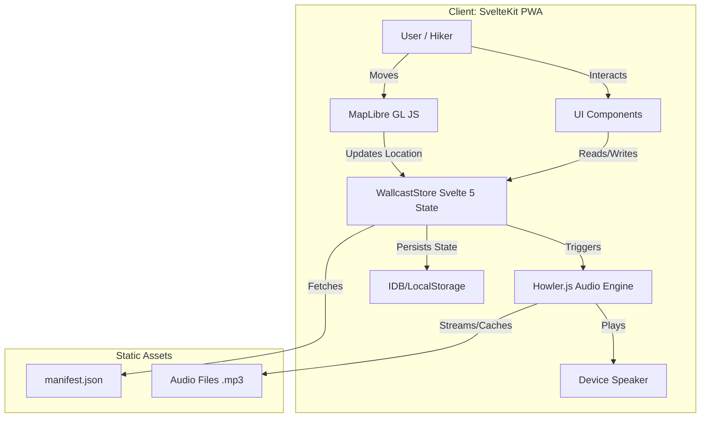
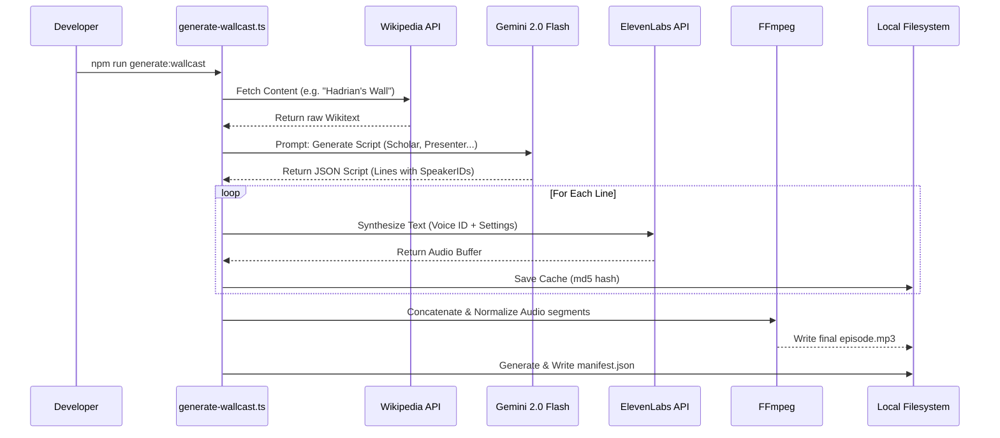
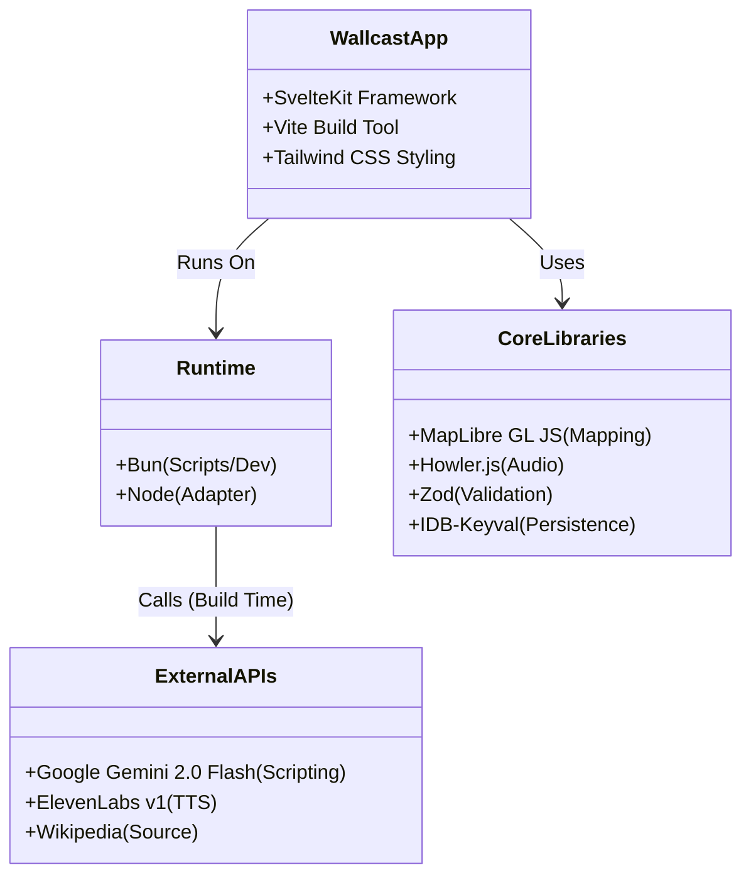

# Wallcast — Hadrian’s Wall Immersive Audio System

## 1. Introduction
**Wallcast** is a core feature of **Hadrian Atlas v4.2**, designed as an offline-first, immersive audio experience for the Hadrian’s Wall Path. It is not a standard audio guide; it is a dynamic, location-aware "narrative layer" that simulates walking with a roundtable of world-class historians.

The system uses AI to generate multi-voice conversations that include debate, disagreement, and diverse perspectives, transforming the hike into a rich, educational journey that feels alive.

## 2. Goals
*   **Engagement:** Keep users listening for extended periods (30-60 mins) during hikes by maintaining a dynamic, conversational rhythm.
*   **Education:** Provide factually accurate, multi-perspective historical context that balances micro-level archaeology with macro-level strategy.
*   **Immersion:** Create an audio atmosphere that blends seamlessly with the physical landscape, adhering to the project's "National Geographic meets Modernism" aesthetic.
*   **Reliability:** Ensure flawless playback in remote areas with no connectivity, leveraging the app's PWA architecture.
*   **Usability:** Design for "exhausted hiker" constraints—one-thumb operation, high glare visibility, and zero friction.
*   **Performance:** Achieve "instant" feel through aggressive caching and minimal client-side execution (LCP < 2.5s).

## 3. Product Requirements & User Experience

### 3.1 The "Roundtable" Concept
Unlike typical audio guides that use a single narrator, Wallcast simulates a **panel of experts**. The content must reflect:
*   **Intelligent Disagreement:** Speakers should challenge each other’s interpretations (e.g., "The traditional view is X, but recent excavations suggest Y").
*   **Tonal Variety:** A mix of academic rigor, field enthusiasm, and strategic analysis.
*   **No Monotony:** Avoid the "museum voice"; emulate the energy of a high-quality BBC history documentary (e.g., *In Our Time*).

### 3.2 The Voice Personas
The system (via ElevenLabs) must consistently use specific voice profiles to represent these archetypes:
1.  **The Scholar (e.g., Mary Beard archetype):** Focuses on myth-busting, social history, and the "lived experience" of Romans and locals.
2.  **The Archaeologist (e.g., David Breeze archetype):** Focuses on the physical wall, construction phases, and excavation evidence.
3.  **The Strategist (e.g., Niall Ferguson archetype):** Focuses on the macro-economics, imperial power dynamics, and military strategy.
4.  **The Presenter (e.g., Dan Snow/Tristan Hughes archetype):** Energetic, landscape-focused, ties history to what the hiker is currently seeing.

### 3.3 User Stories
*   **As a Hiker**, I want to hear different expert voices debating history, so the content feels dynamic and not like a lecture.
*   **As a Hiker**, I want the app to suggest relevant audio when I enter a specific trail segment, so I don't have to fumble with my phone.
*   **As a Planner**, I want to download the entire "Trail Pack" before I leave home, ensuring I have all audio offline.
*   **As a History Enthusiast**, I want "Deep Dive" specials for major sites (Vindolanda, Housesteads) that go beyond the standard timeline.
*   **As an Outdoor User**, I want to play/pause audio from my lock screen or using large touch targets, because I might be wearing gloves or using poles.

### 3.4 Feature Constraints
*   **No Dramatization:** Detailed historical reconstruction is allowed, but no fictional dialogues.
*   **Evidence-Based:** Scripts must be grounded in curated source documents (Wikipedia, academic notes).
*   **Structure:**
    *   **Standard Segments:** 30 minutes (covering ~3 hours of hiking). Target 4,500–5,500 words.
    *   **Major Site Specials:** 45–60 minutes. Target 7,000–9,000 words.
    *   **Arc:** Cold Open → Strategic Context → Lived Experience → Archaeology → Landscape → Reflection.

## 4. Technical Architecture & Stack

### 4.1 Tech Stack Alignment
*   **Runtime:** **Bun** (for CLI generation scripts & local dev).
*   **Framework:** **SvelteKit** + **Vite** (matches host app).
*   **Styling:** **Tailwind CSS v4** (matches host app).
*   **Mapping:** **MapLibre GL JS**.
*   **Audio Engine:** **Howler.js**.
*   **AI/Generation:** **ElevenLabs** (TTS), **Qwen/Gemini Flash** (Script Generation).
*   **Validation:** **Zod** (for all inputs/outputs).

### 4.2 Generation Pipeline ("The Factory")
Wallcast content is pre-generated offline via a CLI tool (`bun run generate-wallcast`).
1.  **Ingestion:**
    *   Fetch raw Wikitext for segment entities (e.g., "Sycamore Gap").
    *   Parse and extract key historical dates, debates, and coordinates.
2.  **Script Generation (LLM):**
    *   Prompt LLM to assume the 4 personas.
    *   Generate a multi-turn JSON script with `speaker_id`, `text`, and `tone`.
    *   *Constraint:* Enforce "Roundtable" format and factual accuracy.
3.  **Synthesis (ElevenLabs):**
    *   Map `speaker_id` to specific ElevenLabs Voice IDs.
    *   Generate audio for each line (hashing text to cache/skip existing lines).
4.  **Audio Engineering (FFmpeg):**
    *   Concatenate lines into a single track.
    *   Normalize loudness (EBU R 128) for outdoor listing consistency.
    *   Mix in subtle intro/outro cues (no background music during speech).
5.  **Manifest Creation:**
    *   Output `wallcast.json` with metadata, geofences, and file paths.

### 4.3 Client-Side Implementation (Web Audio & Svelte 5)
*   **State Management (Runes):**
    *   Use Svelte 5 `$state` primitive in `wallcast-player.svelte.ts` to manage playback status (playing, paused, buffering, time).
    *   Use `$effect` to handle side effects (persisting position to `localStorage`).
*   **Audio Handling (Howler.js):**
    *   **Mobile Unlock:** Set `Howler.autoUnlock = false`. Explicitly unlock AudioContext on the first user interaction (Play button tap).
    *   **Memory:** Aggressively `unload()` clips when changing segments to avoid Safari memory pressure.
    *   **Background:** Implement `navigator.mediaSession` for lock-screen control.
*   **Map Integration (MapLibre):**
    *   **Layers:** Use a dedicated `symbol` layer for Wallcast markers, ensuring `z-index` is higher than standard POIs.
    *   **Interactivity:** Ensure hit targets are >= 44px (using transparent padding if necessary).

## 5. Aesthetic & Design System
*   **Visual Language:** "National Geographic meets Modernism." Bold, tool-like, high contrast.
*   **Design Tokens (from `src/app.css`):**
    *   **Colors:** OKLCH Scale (`var(--n*)`, `var(--blue-*)`).
        *   Text: `var(--text-primary)` (High Contrast) for legibility in sunlight.
        *   Action: `var(--action-primary)` for Play/Pause.
    *   **Typography:**
        *   Headings: `var(--font-display)` ("iA Writer Duo").
        *   Data: `var(--font-data)` ("iA Writer Mono").
        *   Long Form: `var(--font-reading)` ("iA Writer Quattro").
    *   **Components:** Use `ds-panel`, `ds-chip`, `hairline-border` classes.
*   **Responsive Rules:**
    *   **Thumb Zone:** All controls (Play, Skip, Download) must be in the bottom 40% of the screen on mobile.
    *   **Touch Targets:** Minimum **44x44px** for all interactive elements.

## 6. Development Guidelines
*   **TDD Methodology:**
    *   **Red-Green-Refactor:** Write a failing test before ANY production code.
    *   **Testing Layers:**
        *   *Unit:* `wallcast.test.ts` (State logic, manifest parsing).
        *   *Integration:* `audio-service.test.ts` (Mocked Howler interactions).
        *   *Failure:* Test behavior when network, GPS, or audio decoding fails.
*   **Performance Rules:**
    *   **Static First:** UI must render instantly from HTML; JS hydrates the interactive player.
    *   **Offline First:** Service Worker must eagerly cache audio manifests and user-selected audio packs.

## 7. Open Questions
*   **Hosting:** Should audio files be hosted on R2/S3 or within the repo (LFS)?
*   **GPS Power:** How to balance location precision with battery life for all-day listeners?
*   **Context Sharing:** Does `AudioService` (footsteps) need to pause/duck when Wallcast plays?

## 8. Technical Diagrams (As Built)

### 8.1 System Architecture

### 8.2 Data Flow: The Generation Factory

### 8.3 Tech Stack & Integrations

